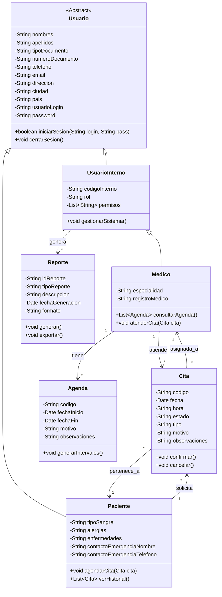
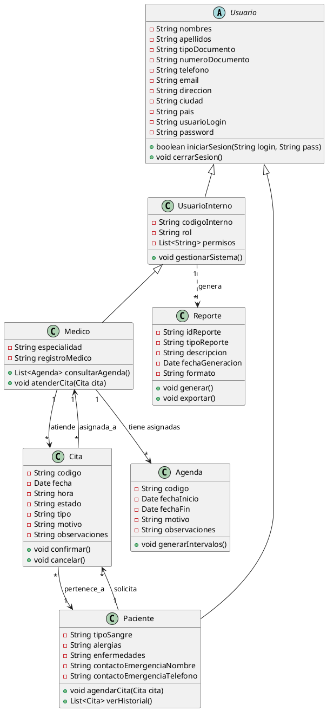

# Diagrama de Clases - Hospital San Paco

Este documento presenta el diseño de clases para el sistema de gestión hospitalaria "San Paco", basado en los requerimientos y formularios web analizados.

## 1. Justificación del Diseño

Se ha optado por un diseño orientado a objetos utilizando herencia para gestionar los diferentes tipos de usuarios:

*   **Usuario (Abstracta):** Contiene los datos comunes a todas las personas que interactúan con el sistema (nombre, documento, contacto, credenciales).
*   **UsuarioInterno (Extiende Usuario):** Representa a los empleados del hospital. Incluye código de empleado, rol y permisos.
*   **Medico (Extiende UsuarioInterno):** Se separa como una entidad independiente que hereda de `UsuarioInterno`. Esto se debe a que, aunque es un empleado, tiene atributos exclusivos como `especialidad` y es la única entidad que puede tener `Agendas` y ser asignada a `Citas`.
*   **Paciente (Extiende Usuario):** Representa a los usuarios externos. Contiene información clínica básica (tipo de sangre, alergias) y contactos de emergencia.

## 2. Descripción Textual de Clases

### Clases de Usuarios

*   **`Usuario` (Clase Abstracta)**
    *   Atributos: `nombres`, `apellidos`, `tipoDocumento`, `numeroDocumento`, `telefono`, `email`, `direccion`, `ciudad`, `pais`, `usuarioLogin`, `password`.
    *   Métodos: `iniciarSesion()`, `cerrarSesion()`.

*   **`UsuarioInterno` extends `Usuario`**
    *   Atributos: `codigoInterno` (ej. EMP-00123), `rol` (ADMIN, RECEPCIONISTA, OPERARIO, MEDICO), `permisos` (Lista de accesos).
    *   Métodos: `gestionarSistema()`.

*   **`Medico` extends `UsuarioInterno`**
    *   Atributos: `especialidad` (Cardiología, Pediatría, etc.), `registroMedico`.
    *   Relaciones:
        *   Tiene muchas `Agendas`.
        *   Tiene muchas `Citas` asignadas.
    *   Métodos: `consultarAgenda()`, `atenderCita()`.

*   **`Paciente` extends `Usuario`**
    *   Atributos: `tipoSangre`, `alergias`, `enfermedades`, `contactoEmergenciaNombre`, `contactoEmergenciaTelefono`.
    *   Relaciones:
        *   Tiene historial de `Citas`.
    *   Métodos: `agendarCita()`, `verHistorial()`.

### Clases de Gestión

*   **`Cita`**
    *   Atributos: `codigo` (CIT-XXXX), `fecha`, `hora`, `estado` (AGENDADA, CONFIRMADA, ETC), `tipo`, `motivo`, `observaciones`.
    *   Relaciones:
        *   Pertenece a un `Paciente`.
        *   Es atendida por un `Medico`.
    *   Métodos: `confirmar()`, `cancelar()`, `finalizar()`.

*   **`Agenda`**
    *   Atributos: `codigo` (AGD-XXXX), `fechaInicio`, `fechaFin`, `motivo` (Creación, Reemplazo), `observaciones`.
    *   Relaciones:
        *   Asignada a un `Medico`.
    *   Métodos: `generarIntervalos()`.

*   **`Reporte`**
    *   Atributos: `idReporte`, `tipoReporte`, `descripcion`, `fechaGeneracion`, `formato` (PDF, EXCEL), `ubicacionArchivo`.
    *   Relaciones:
        *   Generado por un `UsuarioInterno`.
    *   Métodos: `generar()`, `exportar()`.

## 3. Diagrama Mermaid

## 4. Diagrama PlantUML

